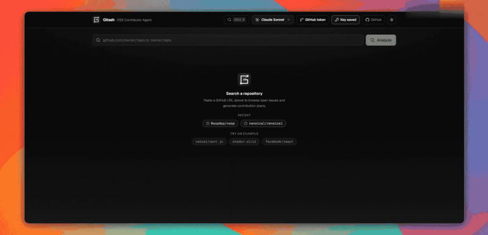

# Gitash

> Browse any public GitHub repository, filter open issues, and get a step-by-step AI contribution plan — powered by Claude, GPT, or Gemini.

**[Live demo → gitash.space](https://www.gitash.space)**


[](LICENSE)
[](https://vercel.com/new/clone?repository-url=https://github.com/nijil71/Gitash)

---

## Demo



---

## What it does

- **Browse any public GitHub repo** — paste a full URL or `owner/repo` shorthand
- **Filter, search & sort** — combine multiple labels, search loaded issues, sort by newest / recently updated / most commented, and page through results
- **Pick your AI** — choose between Claude (Anthropic), GPT (OpenAI), or Gemini (Google)
- **Code-grounded plans** — a quick AI pass picks the most relevant files, their real contents are fetched from GitHub, and the plan is written against actual code (real function and component names, not guesses from file names)
- **Duplicate-work guard** — selecting an issue checks for open PRs that already reference it; if found (or the issue is already closed), plan generation pauses behind a dialog so you can review the existing work before spending tokens (cached plans are free and never paused)
- **Stale-plan warning** — a cached plan warns when the issue has been updated since it was generated, with one-click regenerate
- **Convention-aware plans** — if the repo has a CONTRIBUTING file, the AI reads it and bakes CLA, commit-format, and "discuss first" rules into the prerequisites and gotchas; a Guide button links to it from every plan
- **Rate-limit heads-up** — when your GitHub request budget runs low, a banner warns you (with reset time) and offers the one-click token setup before things start failing
- **Streaming, structured plans** — summary, difficulty + effort estimate, prerequisites, relevant files, step-by-step guide, testing notes, and gotchas, streamed in live
- **Actionable output** — every plan suggests a branch name and one-click Fork / web-editor / Open-PR links; copy or download as Markdown
- **Stay organized** — bookmark issues, revisit recent repos, and navigate the list by keyboard (`/` to search, ↑/↓ to move)
- **Higher rate limits** — add a GitHub token in-app to go from 60 to 5,000 req/hr (and reach private repos)
- **Privacy-first** — your AI key and GitHub token live only in your browser (`localStorage`), sent directly to the provider, never through our server

---

## How it works

```
1. User picks an AI provider and saves their API key (stored in localStorage)
2. Paste a GitHub repo URL → fetches repo meta + labels via GitHub REST API
3. Select label filter(s) → fetches matching open issues (search/sort/paginate client-side + via the API)
4. Click an issue → checks GitHub for open PRs already referencing it
        └── if found, generation pauses: review the PR, or "Generate plan anyway"
5. Stage 1 — POST /api/analyze { mode: "select-files" }
        └── AI picks the ≤5 most relevant paths from the file tree
                └── their real contents are fetched from GitHub (client-side)
6. Stage 2 — POST /api/analyze
        ├── x-api-key header  (your key, direct to provider)
        ├── provider: "claude" | "openai" | "gemini"
        ├── issue context (title, body, labels, repo)
        ├── fileTree (filtered list of the repo's real source paths)
        ├── fileContents (the stage-1 picks, truncated)
        ├── contributingGuide (the repo's CONTRIBUTING file, if present)
        └── comments (the issue discussion, fetched from GitHub)
                └── AI streams a structured plan (summary, difficulty,
                    files, steps, testing, gotchas…)
                        └── Parsed and rendered live in the contribution panel
```

The route handler at [`app/api/analyze/route.ts`](app/api/analyze/route.ts) dispatches to the selected provider using your key from the request header. Nothing is logged or stored server-side.

---

## Getting started

```bash
# 1. Clone
git clone https://github.com/nijil71/Gitash
cd Gitash

# 2. Install dependencies
npm install

# 3. Start the dev server
npm run dev
```

Requires **Node.js 18.17+**.

Open [http://localhost:3000](http://localhost:3000) — you'll be greeted by the provider selection screen.

---

## API key setup

On first visit, Gitash shows a setup screen with three provider cards. Click the one you want, paste your key, and you're in. Keys are stored per-provider in `localStorage` and the last-used provider is remembered across sessions.

| Provider | Where to get a key | Key format |
|---|---|---|
| **Claude** (Anthropic) | [console.anthropic.com](https://console.anthropic.com/) | `sk-ant-...` |
| **GPT** (OpenAI) | [platform.openai.com/api-keys](https://platform.openai.com/api-keys) | `sk-proj-...` |
| **Gemini** (Google) | [aistudio.google.com/app/apikey](https://aistudio.google.com/app/apikey) | `AIzaSy...` |

You can switch providers at any time from the header — each provider's key is stored independently.

---

## Tech stack

| Layer | Technology |
|---|---|
| Framework | [Next.js 14](https://nextjs.org) (App Router) |
| Language | TypeScript 5 |
| Styling | [Tailwind CSS 3](https://tailwindcss.com) + [shadcn/ui](https://ui.shadcn.com) |
| Icons | [Lucide React](https://lucide.dev) |
| AI — Claude | [Anthropic SDK](https://github.com/anthropics/anthropic-sdk-typescript) · `claude-sonnet-4-6` |
| AI — OpenAI | [OpenAI SDK](https://github.com/openai/openai-node) · `gpt-5.5` |
| AI — Gemini | [Google Generative AI SDK](https://github.com/google/generative-ai-js) · `gemini-3.5-flash` |
| Data | GitHub REST API v3 (unauthenticated, 60 req/hr) |
| Fonts | Geist Sans / Geist Mono (local, via `next/font`) |
| Deployment | [Vercel](https://vercel.com) (recommended) |

---

## Project structure

```
.
├── app/
│   ├── api/
│   │   ├── analyze/route.ts   # AI provider dispatch (streaming)
│   │   └── favicon/route.ts   # SVG favicon route
│   ├── globals.css            # Tailwind + theme CSS variables
│   ├── layout.tsx             # Root layout + no-FOUC theme script
│   └── page.tsx               # Main app + setup screen
├── components/
│   ├── ui/                    # shadcn primitives
│   ├── ApiKeyModal.tsx
│   ├── GitHubTokenModal.tsx   # Optional PAT for higher rate limits
│   ├── ContributionPlan.tsx   # Streaming plan panel
│   ├── CopyButton.tsx
│   ├── GitashIcon.tsx         # Custom SVG logo component
│   ├── IssueCard.tsx
│   ├── IssueControls.tsx      # Search + sort bar
│   ├── IssueList.tsx
│   ├── LabelFilter.tsx
│   ├── PlanGate.tsx           # Pauses plan generation: linked open PR / closed issue
│   ├── LoadingSkeleton.tsx
│   ├── ModelSelector.tsx
│   ├── RepoInput.tsx
│   └── ThemeToggle.tsx
├── lib/
│   ├── github.ts              # GitHub API client
│   ├── models.ts              # Provider config
│   ├── parseRepo.ts           # URL parser
│   ├── planParse.ts           # Tolerant/streaming plan parser
│   ├── recentRepos.ts         # Recent-repo history (localStorage)
│   ├── bookmarks.ts           # Saved issues (localStorage)
│   └── utils.ts               # cn() helper
├── public/logos/              # Provider SVG logos
└── types/index.ts
```

---

## Deploying to Vercel

No environment variables required — users supply their own API keys in-app.

[](https://vercel.com/new/clone?repository-url=https://github.com/nijil71/Gitash)

---

## GitHub API rate limits

Unauthenticated GitHub API requests are limited to **60 per hour** per IP. To raise the limit to **5,000/hr** (and access private repos), click **GitHub token** in the header and paste a [personal access token](https://github.com/settings/tokens/new?description=Gitash&scopes=public_repo). Like your AI key, it's stored only in your browser (`localStorage`) and sent directly to GitHub — never to our server.

---

## Contributing

Found a bug or want a new feature? Open an issue — then use **this very tool** to generate a contribution plan for it.

1. Fork the repository
2. Create a feature branch: `git checkout -b feat/your-feature`
3. Commit your changes and open a pull request

Please keep PRs focused — one feature or fix per PR.

---

## License

[MIT](LICENSE) © [nijil71](https://github.com/nijil71)

